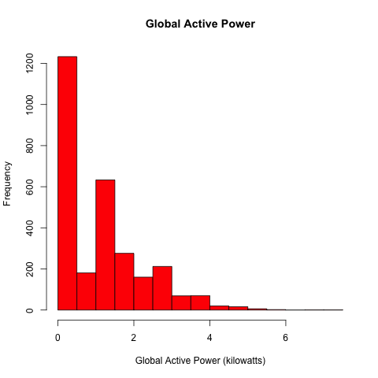
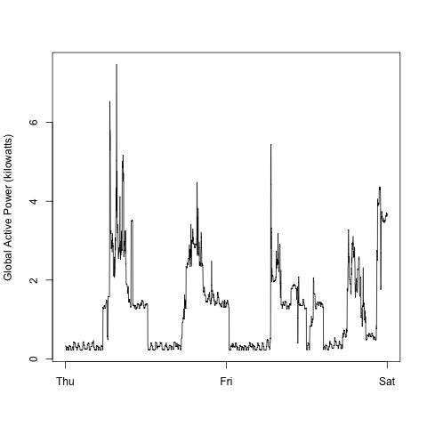
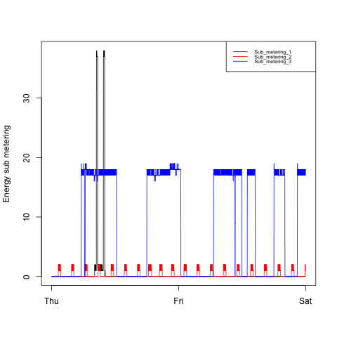
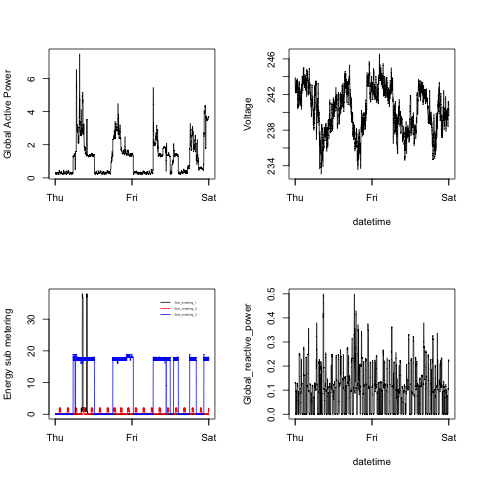

## Instruction

>Our overall goal here is simply to examine how household energy usage
varies over a 2-day period in February, 2007. Your task is to
reconstruct the following plots below, all of which were constructed
using the base plotting system.

>First you will need to fork and clone the following GitHub repository:
[https://github.com/rdpeng/ExData_Plotting1](https://github.com/rdpeng/ExData_Plotting1)


>For each plot you should

>* Construct the plot and save it to a PNG file with a width of 480
pixels and a height of 480 pixels.

>* Name each of the plot files as `plot1.png`, `plot2.png`, etc.

>* Create a separate R code file (`plot1.R`, `plot2.R`, etc.) that
constructs the corresponding plot, i.e. code in `plot1.R` constructs
the `plot1.png` plot. Your code file **should include code for reading
the data** so that the plot can be fully reproduced. You should also
include the code that creates the PNG file.

>* Add the PNG file and R code file to your git repository

>When you are finished with the assignment, push your git repository to
GitHub so that the GitHub version of your repository is up to
date. There should be four PNG files and four R code files.

## Submission: Load data

```r
# set working dir
setwd("~/R/expdata/ExData_Plotting1")

library(dplyr)

# download and read if data frame object doesn't exist
if (!exists("powcon")) {
        # download and unzip data
        download.file("https://d396qusza40orc.cloudfront.net/exdata%2Fdata%2Fhousehold_power_consumption.zip",
                      "householdPowerConsumption.zip",
                      method = "curl")
        unzip("householdPowerConsumption.zip", exdir = "./")
        
        # load rows for from the dates 2007-02-01 and 2007-02-02 only
        powcon <- tbl_df(read.table("household_power_consumption.txt", 
                             header = TRUE, 
                             sep = ";",
                             na.strings = "?",
                             skip = 66637,
                             nrows = 2880))
        
        # col names
        names(powcon) = unlist(strsplit("Date;Time;Global_active_power;Global_reactive_power;Voltage;Global_intensity;Sub_metering_1;Sub_metering_2;Sub_metering_3",
                                        ";"))
        
        # add a column to indicate the weekday
        library(lubridate)
        powcon <- mutate(powcon, wday = wday(dmy(Date), label = TRUE, abbr = TRUE))
}

```

## Submission: Plot1
```r
# load data
source("loadData.R")

# set to plot only 1 graphic
par(mfcol = c(1,1))

# plotting
hist(powcon$Global_active_power, 
     col = "red", 
     main = "Global Active Power", 
     xlab = "Global Active Power (kilowatts)")

# save to png
dev.copy(png, file = "plot1.png", width = 480, height = 480)
dev.off()
```

### output


## Submission: Plot2
```r
# load data
source("loadData.R")

# set to plot only 1 graphic
par(mfcol = c(1,1))

# plotting without x-axis ticks
with(powcon, 
     plot(Global_active_power,
          type = "l",
          col = "black", 
          xaxt = "n",
          xlab = "",
          ylab = "Global Active Power (kilowatts)")
)
# add x-axis ticks
with(powcon, 
     axis(1, at = c(grep("Thu", wday)[1],grep("Fri", wday)[1], grep("Sat", wday)[1]), 
          labels = c("Thu", "Fri", "Sat"))
)

# save to png
dev.copy(png, file = "plot2.png", width = 480, height = 480)
dev.off()
```

### plotted png


## Submission: Plot3
```r
# load data
source("loadData.R")

# set to plot only 1 graphic
par(mfcol = c(1,1))

# plotting without x-axis ticks
with(powcon, 
     plot(Sub_metering_1,
          type = "n",
          xaxt = "n",
          xlab = "",
          ylab = "Energy sub metering")
)
# add x-axis ticks
with(powcon, 
     axis(1, at = c(grep("Thu", wday)[1],grep("Fri", wday)[1], grep("Sat", wday)[1]), 
          labels = c("Thu", "Fri", "Sat"))
)
# add lines
lines(powcon$Sub_metering_1, type = "l", col = "black")
lines(powcon$Sub_metering_2, type = "l", col = "red")
lines(powcon$Sub_metering_3, type = "l", col = "blue")
# add legends
legend("topright", 
       legend = c("Sub_metering_1","Sub_metering_2","Sub_metering_3"), #legend text
       col = c("black","red", "blue"), # color
       lty = rep(1,n=3),               #line type
       cex = 0.6,                      #character expansion
       y.intersp=0.3)                  #character interspacing factor for vertital(y)

# save to png
dev.copy(png, file = "plot3.png", width = 480, height = 480)
dev.off()
```

### plotted png


## Submission: Plot4
```r
# load data
source("loadData.R")

# set the layout to plot 2x2 
par(mfcol = c(2,2))

# plotting graphic#1
with(powcon, c(
        plot(Global_active_power,
             type = "l",
             col = "black", 
             xaxt = "n",
             xlab = "",
             ylab = "Global Active Power"),
        axis(1, at = c(grep("Thu", wday)[1],grep("Fri", wday)[1], grep("Sat", wday)[1]), 
             labels = c("Thu", "Fri", "Sat"))
))

# plotting graphic#2
with(powcon, c(
        plot(Sub_metering_1,
             type = "n",
             xaxt = "n",
             xlab = "",
             ylab = "Energy sub metering"),
        # add x-axis ticks
        axis(1, at = c(grep("Thu", wday)[1],grep("Fri", wday)[1], grep("Sat", wday)[1]), 
             labels = c("Thu", "Fri", "Sat")),
        # add lines
        lines(Sub_metering_1, type = "l", col = "black"),
        lines(Sub_metering_2, type = "l", col = "red"),
        lines(Sub_metering_3, type = "l", col = "blue"),
        # add legends
        legend("topright", 
               legend = c("Sub_metering_1","Sub_metering_2","Sub_metering_3"), #legend text
               col = c("black","red", "blue"), #color
               bty = "n",                      #legend without box
               lty = rep(1,n=3),               #line type
               cex = 0.3,                      #character expansion
               y.intersp=0.3)                  #character interspacing factor for vertital(y)
))

# plotting graphic#3
with(powcon, c(
        plot(Voltage,
             type = "l",
             xaxt = "n",
             xlab = "datetime",
             ylab = "Voltage"),
        # add x-axis ticks
        axis(1, at = c(grep("Thu", wday)[1],grep("Fri", wday)[1], grep("Sat", wday)[1]), 
             labels = c("Thu", "Fri", "Sat"))
))


# plotting graphic#4
with(powcon, c(
        plot(Global_reactive_power,
             type = "l",
             xaxt = "n",
             xlab = "datetime"
             #ylab = "Voltage"
             ),
        # add x-axis ticks
        axis(1, at = c(grep("Thu", wday)[1],grep("Fri", wday)[1], grep("Sat", wday)[1]), 
             labels = c("Thu", "Fri", "Sat"))
))


# save to png
dev.copy(png, file = "plot4.png", width = 480, height = 480)
dev.off()
```

### plotted png
